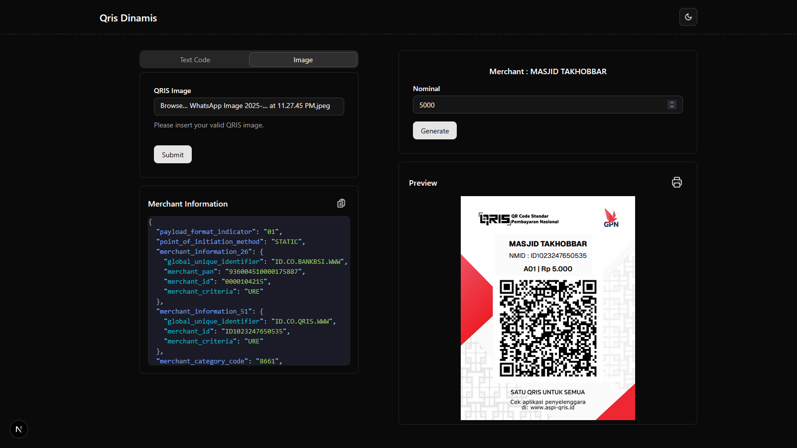

# QRIS Dinamis Generator

Aplikasi web untuk menggenerate QRIS (Quick Response Code Indonesian Standard) dinamis dengan nominal yang dapat disesuaikan. Aplikasi ini memungkinkan pengguna untuk mengubah nominal pembayaran pada QR code yang sudah ada.



## ✨ Fitur

- 🔄 **Generate QRIS Dinamis**: Upload gambar QR code dan ubah nominal pembayaran
- 📝 **Input Text Code**: Masukkan kode QRIS dalam format text untuk diproses
- 🖼️ **Upload Image**: Upload gambar QR code untuk didecode dan dimodifikasi
- 📊 **Merchant Information**: Tampilkan informasi merchant secara detail dalam format JSON
- 💰 **Custom Nominal**: Ubah nominal pembayaran sesuai kebutuhan
- 📱 **Preview Real-time**: Lihat preview QR code yang sudah dimodifikasi
- 💾 **Download QR**: Download QR code yang sudah dimodifikasi dalam format gambar
- 🌙 **Dark/Light Theme**: Toggle antara tema gelap dan terang

## 🛠️ Teknologi yang Digunakan

- **Framework**: [Next.js 14](https://nextjs.org) dengan App Router
- **Language**: TypeScript
- **Styling**: Tailwind CSS
- **UI Components**: Shadcn/ui
- **State Management**: Zustand
- **QR Processing**: Custom QRIS decoder
- **Canvas**: html2canvas-pro untuk export gambar

## 📋 Prerequisites

Pastikan Anda memiliki yang berikut ini terinstall:

- Node.js (versi 18 atau lebih baru)
- npm, yarn, pnpm, atau bun

## 🚀 Getting Started

1. **Clone repository**

```bash
git clone <repository-url>
cd nextjs-qris-dinamis
```

2. **Install dependencies**

```bash
npm install
# atau
yarn install
# atau
pnpm install
# atau
bun install
```

3. **Jalankan development server**

```bash
npm run dev
# atau
yarn dev
# atau
pnpm dev
# atau
bun dev
```

4. **Buka browser**
   Akses [http://localhost:3000](http://localhost:3000) untuk melihat aplikasi.

## 📖 Cara Penggunaan

### 1. Input via Text Code

- Pilih tab "Text Code"
- Paste kode QRIS dalam format text
- Aplikasi akan otomatis decode informasi merchant

### 2. Input via Image Upload

- Pilih tab "Image"
- Upload gambar QR code yang valid
- Aplikasi akan memproses dan extract informasi

### 3. Modifikasi Nominal

- Masukkan nominal baru di field "Nominal"
- Klik "Generate" untuk membuat QR code baru
- Preview akan menampilkan QR code yang sudah dimodifikasi

### 4. Download QR Code

- Klik icon download di bagian preview
- QR code akan tersimpan sebagai file JPG

## 📁 Struktur Project

```
src/
├── app/                    # App router pages
│   ├── globals.css        # Global styles
│   ├── layout.tsx         # Root layout
│   └── page.tsx           # Home page
├── components/            # React components
│   ├── form-qris-change/  # Form untuk mengubah QRIS
│   ├── form-qris-image/   # Form upload image
│   ├── form-qris-string/  # Form input text
│   ├── json-template/     # Template JSON viewer
│   ├── navigation/        # Navigation component
│   ├── qris-image/        # Preview QR image
│   ├── theme/            # Theme provider
│   ├── theme-button/     # Theme toggle button
│   └── ui/               # UI components (shadcn)
├── lib/                  # Utilities dan libraries
│   ├── store/            # Zustand store
│   ├── qris-decoder/     # Custom QRIS decoder
│   └── utils.ts          # Utility functions
└── types/               # TypeScript type definitions
```

## 🔧 Konfigurasi

Project ini menggunakan konfigurasi standar Next.js dengan tambahan:

- **Tailwind CSS**: Untuk styling
- **TypeScript**: Untuk type safety
- **ESLint**: Untuk code linting
- **PostCSS**: Untuk CSS processing


## 🙏 Acknowledgments

- [Next.js](https://nextjs.org) - React framework
- [Tailwind CSS](https://tailwindcss.com) - CSS framework
- [Shadcn/ui](https://ui.shadcn.com) - UI components
- [Zustand](https://github.com/pmndrs/zustand) - State management
